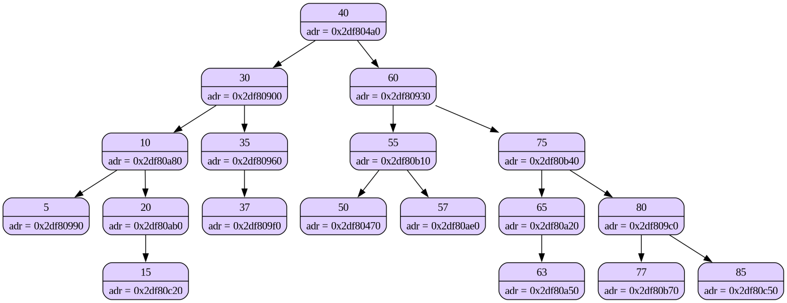
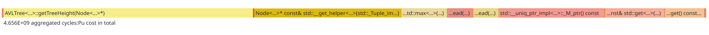

<div align="center">
AVL Tree Implementation
</div>


## Tree Structure
Here's how **AVL Tree** structure looks like

<details open>

```cpp
template <typename KeyT, typename Comp>
class AVLTree {
    private:
        std::unique_ptr<Node<KeyT>> top_node;
        Comp comp;
        void dumpTreeRecursive(Node<KeyT> *node, std::ofstream& file, int depth=0);

        unsigned int node_color = 0xE0D0FF;

    public:
        void insert(KeyT key);
        Node<KeyT>* lower_bound(KeyT key);
        Node<KeyT>* upper_bound(KeyT key);

    public: // dump
        void dumpTree(Node<KeyT> *node, std::string filename);

    public: // constructor
        AVLTree(Comp InComp) : comp(InComp), top_node(nullptr) {

        }

    public:
        Node<KeyT> *getTopNode() {
            return top_node.get();
        }
};
```
</details>

### Rotations for AVL Tree

how to read rotations?
- **first** is for the child, **second** is for the subtree

| Rotation Type | Semantics | Descriptipon |
|---------------|-----------|--------------|
|   LL          |           | occurs when inserting _left_ child into the _left_ subtree && balance_factor > +1            |
|   RR          |           | occurs when inserting _right_ child into the _right_ subtree && balance_factor < -1              |
|   LR          |           | occurs when inserting _left_ child into the _right_ subtree making it **left-heavy**              |
|   RL          |           | occurs when inserting _right_ child into the _left_ subtree making it **right-heavy**              |

### Using graphviz for better debug


command line flag for dumping image:
```
./avl_tree --dump
```

### Testing

You can test correct answers for `range queries` using `avl_tree_regular` target
###### Typical usecase (with dump)
```
./avl_tree_regular < ../tests/01.dat --dump
```

You can also test performance using apporpriate targets for that
There are two benchmarks available
1. `avl_tree_timebench` - provides time info for custom `AVLTree` implementation
2. `set_timebench` - provides time info for `std::set` from standard C++ library


## Dealing with bad performance
- [this](./tests/test.dat) test got me in trouble.

I need to find a bottleneck to solve it.

This is what I use in command line:
1. `perf record ./avl_tree_timebench < ../tests/test.dat `
2. `hotspot`

The flame graph I saw in hotspot


> getTreeHeight is the bottleneck

<div style="border-left: 5px solid #ffc107; padding: 12px; margin: 10px 0; background: #fff
">
💡 <strong>idea:</strong> contain tree height inside a node.
</div>

_💁‍♂️ it worked_

This was the code before

<details open>

```cpp

(*node_ptr)->height = getTreeHeight((*node_ptr).get());
if ((*node_ptr)->left)  (*node_ptr)->left->height = getTreeHeight((*node_ptr)->left.get());
((*node_ptr)->right) (*node_ptr)->right->height = getTreeHeight((*node_ptr)->right.get());
```
</details>

This is what the code after

<details open>

```cpp

updateHeight((*node_ptr).get());
updateHeight((*node_ptr)->left.get());
updateHeight((*node_ptr)->right.get());

```
</details>

Basically I just don't spend time on counting tree height from the top_node every time. Instead, I update it using the heights of node's children, what is obviously faster (because it is not recursive).

----

For testing I will run `test.dat` on 10000 cycles to compare the results before and after.

| Before opt | After opt |
|------------|-----------|
| 1085028165ns | 371836623ns |
| 1093385365ns             | 513393055ns |
| 1156352390ns             | 361827946ns |
| 1047397737ns             | 504020401ns |
| 1039771778ns             | 507487802ns |
| 1044891117ns             | 358567594ns |
| 1036473995ns             | 523178863ns |
| 1054563483ns             | 508857641ns |

| Mean Before, s | Mean After, s | SpeedUp, x| SpeedUp, % |
|-------------|------------|------------|-------|
| 1.07        | 0.46       | 2.35       | 57.4  |

The optimization gave us more than `x2` to performance.


##### checkpoints
| # | description| done/undone|
|---|------------|-----------|
| 1 |Write LL, LR, RR, RL functions for AVL tree class|     ☑️      |
| 2 | write CLI for tests            |     ☑️      |
